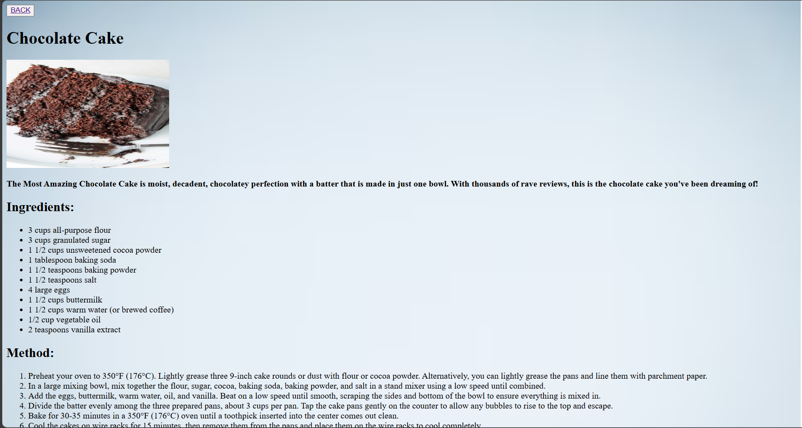

# food_recipe_website
# Grandma's Recipe Website

This project is a web-based platform for sharing and exploring a wide variety of recipes. It is designed using HTML and CSS, providing a user-friendly interface for users to browse and contribute recipes. The website is specifically tailored for Grandma's Recipe, a collection of beloved family recipes passed down through generations.

# Project Highlights
Grandma's Recipe Website is a platform where users can find and share recipes, including desserts, spicy dishes, and more.
The website includes features such as user login, profile management, and categorized recipe listings.
The project utilizes the following technologies:
HTML for structuring the web pages
CSS for styling and layout
The website is designed to be responsive and user-friendly, ensuring a great experience on both desktop and mobile devices.

# Navigate through different sections such as:
Home
About
feedback
Profile

# Sample Features

Homepage: Introduction to Grandma's Recipe website with featured recipes.
Recipe Categories: Browse recipes by categories like Desserts, Spicy Dishes, etc.
User Login: Users can log in to save their favorite recipes and contribute new ones.
User Profile: Manage personal information and view contributed recipes.
Recipe Submission: Users can add new recipes to the website.

